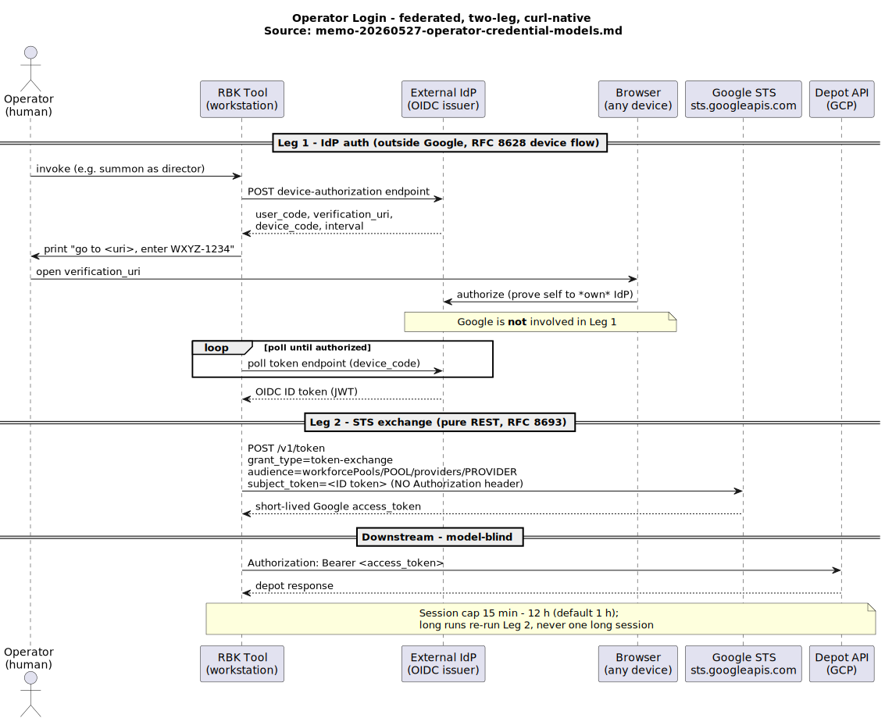
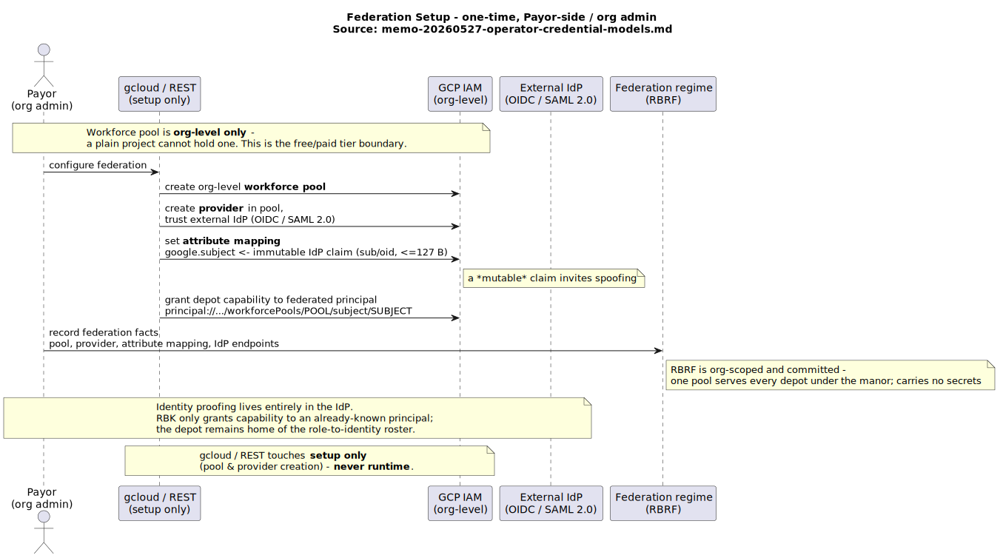
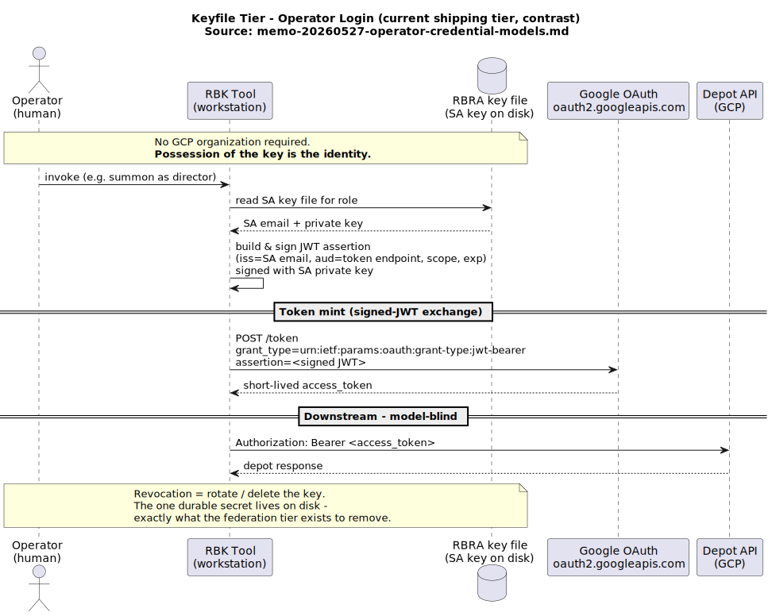
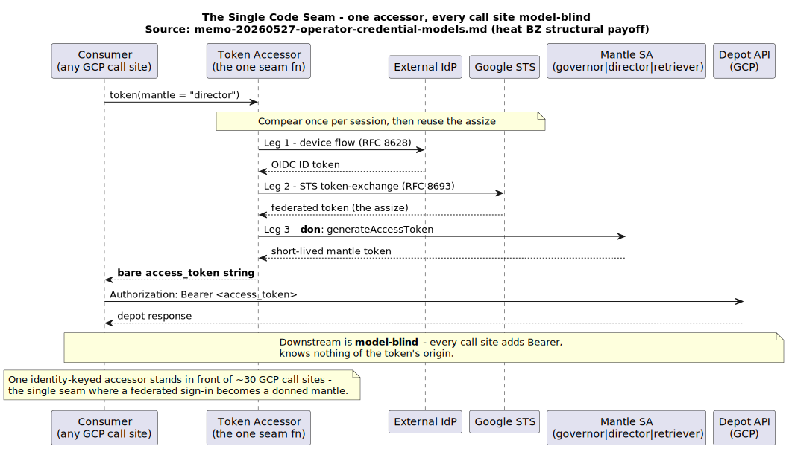

# <a id="RecipeBottle"></a>Recipe Bottle

Containers give you control over what runs. Getting that control to hold at the *edges* — [knowing where an image actually came from](#ControlledContainerBuilds), and [constraining what it can reach once it runs](#RestrictingAccess) — is normally a standing job for a platform team.

[Recipe Bottle](#RecipeBottle) collapses that cost. It's a set of bash scripts with a deliberately tiny dependency surface: running it needs only `bash 3.2`, `curl`, `openssl`, `jq`, and a handful of standard tools — no Python runtime, no language package manager, no `gcloud` CLI — so there is nothing language-specific to install and almost nothing of its own to audit, patch, or trust. A small team can stand up a hardened build pipeline and a sandboxed runtime without one; after initial setup, every cloud API call is `openssl` + `curl`.

It extends a container's control to its two edges:

- **[Foundry](#Foundry)** — *where images come from.* Orchestrates Google Cloud Build to produce multiplatform images (x86 + ARM) with verifiable [SLSA provenance](#Provenance), serves them from a role-managed private cloud registry, and can build [egress-locked](#BuildIsolation) so a compromised build step cannot phone home.
- **[Crucible](#Crucible)** — *what images can reach.* Runs untrusted containers — even images pulled unmodified "in the wild" — behind enforced network isolation: DNS and IP filtering that a compromised workload cannot bypass.

The two compose, but neither requires the other.

> [!IMPORTANT]
> **Early-stage project — security review welcome in both domains**
>
> The [Foundry's](#Foundry) egress-locked Cloud Build configuration — including the [SLSA](#Provenance) attestation chain, [build isolation](#BuildIsolation), and digest-pinned toolchains — has not yet had broad independent review.
>
> The [Crucible](#Crucible) runtime containment — a multi-container apparatus where the workload runs unprivileged in a network namespace it does not control — has also not had broad review, particularly the network isolation rules, privileged namespace setup, and egress enforcement.
>
> If you evaluate or deploy this, you are contributing to its hardening.
> Security-focused contributors and responsible disclosure are especially valued.

**Host platform scope.** [Recipe Bottle](#RecipeBottle) is [release-qualified](#ReleaseProcedure) on Linux and macOS with Docker. Windows host support works and is exercised in testing, but is not yet part of the release-qualification baseline — treat it as supported-experimental for now.

**Project page**: https://scaleinv.github.io/recipebottle

<p align="center">
  
</p>

## Environment

### Supported Platforms

[Recipe Bottle's](#RecipeBottle) [Crucible](#Crucible) runtime is qualified for release against **Docker** as the container runtime, on two host families:

- **Linux host** — native Docker Engine (Docker CE / `docker.io`) running directly on the host kernel; no VM. Tested on Ubuntu LTS with cgroup v2 and a 6.x kernel.
- **macOS host** — Docker Desktop for Mac on a supported macOS release. Apple Silicon hosts use the Apple Virtualization framework or Docker VMM hypervisor backend.

Windows host support works — [Recipe Bottle](#RecipeBottle) runs on Windows via Docker Desktop — but is not yet part of the release-qualification baseline; treat it as supported-experimental pending a green Windows test pass.
Podman support is architecturally accommodated by the spec but deferred — see [Podman Support](#PodmanSupport).

One dependency note for evaluators: [Recipe Bottle's](#RecipeBottle) regression and adversarial test suites — including the [Theurge](#Theurge) orchestrator — are written in Rust. Validating the [Crucible's](#Crucible) containment yourself, or contributing, additionally needs a Rust toolchain; running Recipe Bottle does not.

<a id="Regime"></a>All configuration flows through [Regimes](#Regime) — structured `.env` files with typed validation, each with its own render and validate commands.
Some regimes are committed in the repo: [Vessel](#Vessel) definitions ([RBRV](#RBRV)), [Nameplate](#Nameplate) configurations ([RBRN](#RBRN)), [Depot](#Depot) identity ([RBRD](#RBRD)), repository-wide settings ([RBRR](#RBRR)), and [Payor](#Payor) identity ([RBRP](#RBRP)).
Others live on the filesystem outside revision control: OAuth credentials ([RBRO](#RBRO)), role credentials ([RBRA](#RBRA)), and developer workstation paths ([BURS](#BURS)).

<a id="Tabtarget"></a>Every operation is launched through a [Tabtarget](#Tabtarget) — a shell script in the `tt/` directory.
The critical property: tab completion finds the command you want.
Type `tt/rbw-<TAB>` and the shell narrows to all [Recipe Bottle](#RecipeBottle) operations; type `tt/rbw-h<TAB>` to see just the [Hallmark](#Hallmark) commands.
Each [Tabtarget](#Tabtarget) is named `{colophon}.{frontispiece}.sh` — the colophon routes to the right module, the frontispiece tells you what it does.

<a id="Log"></a>Every state-changing [Tabtarget](#Tabtarget) writes three [Log](#Log) files to the directory named by `BURS_LOG_DIR` in your [BURS](#BURS) station file: a stable-name file (always the same path — easy for tooling to locate and evaluate the most recent run), a per-command file (same command name across runs — tools like SlickEdit sense diffs between executions), and a timestamped historical file (permanent record).
Disk space is cheap; [Log](#Log) unconditionally so the diagnostic evidence is always there when something fails.
Handbooks don't [Log](#Log) — teaching output is ephemeral.

<a id="Transcript"></a>A [Transcript](#Transcript) is a single file capturing key decision points and state transitions within a [Tabtarget's](#Tabtarget) execution.
Where [Logs](#Log) preserve full terminal output, a [Transcript](#Transcript) records the structured progress of sophisticated orchestration commands — the first thing to read when debugging a multi-step failure.

<a id="Output"></a>The [Output](#Output) directory is a fixed-path staging area cleared and recreated before each [Tabtarget](#Tabtarget) runs.
Commands that produce artifacts write them here.
Concurrent bash sessions share this path, so parallel commands can overwrite each other's [Output](#Output).

To begin, run the onboarding walkthrough:

```
tt/rbw-o.ONBOARDING.sh
```

## <a id="Foundry"></a>Foundry

[Recipe Bottle's](#RecipeBottle) remote build orchestration system for producing, attesting, and distributing container images via Google Cloud Build and Google Artifact Registry.
The [Foundry](#Foundry) manages [Depot](#Depot) access, [Vessels](#Vessel) choreography, [Hallmark](#Hallmark) tracking, and build definitions.
Three [Vessel](#Vessel) modes determine how images enter the [Depot](#Depot): [Conjure](#Conjure) ([egress-locked](#BuildIsolation) build from source with [SLSA provenance](#Provenance)), [Bind](#Bind) (digest-pinned upstream mirror), and [Graft](#Graft) (local push).
Peer to [Crucible](#Crucible), which handles local runtime containment.

The [Foundry](#Foundry) orchestrates Google Cloud Build to produce container images with [SLSA](#Provenance) attestation, software bills of material, reproducible multi-architecture builds, and digest-pinned toolchains — so every image has a verifiable origin story.
Builds run in an [egress-locked](#BuildIsolation) configuration, drawing from upstream base images mirrored into a project-owned [Depot](#Depot) registry — a fixed, self-contained supply chain independent of third-party registry availability.

### <a id="Depot"></a>Depot

The facility where container images are built and stored — has its own GCP project with an artifact registry and a storage bucket, funded under the [Manor's](#Manor) billing account.
The [Payor](#Payor) [Levies](#Levy) a [Depot](#Depot), and the [Governor](#Governor) administers access to it.
Each [Depot](#Depot) operates as an independent supply-chain boundary with its own credentials, builds, and registry.

Each [Depot](#Depot) supports two build egress profiles:

- <a id="Tethered"></a>**[Tethered](#Tethered)** — Build egress mode allowing public internet access during Cloud Build. [Tethered](#Tethered) builds pull base images from upstream registries at build time — simpler to set up, but dependent on upstream availability.
- <a id="Airgap"></a>**[Airgap](#Airgap)** — Build egress mode with no public internet access during Cloud Build.
[Airgap](#Airgap) builds draw all dependencies from [Enshrined](#Enshrine) images in the [Depot's](#Depot) registry — fully self-contained, independent of upstream availability.
Requires [Enshrining](#Enshrine) base images before the first build.
See [Build Isolation](#BuildIsolation) for the security rationale behind these profiles.

### <a id="Manor"></a>Manor

The [Payor's](#Payor) administrative seat — holds the billing account, OAuth client, and operator identity.
[Depot](#Depot) projects are created and funded under the [Manor's](#Manor) authority.
The [Manor](#Manor) has its own GCP project, distinct from any [Depot](#Depot) project.

### <a id="Payor"></a>Payor

[Establishes](#Establish) a [Manor](#Manor) and funds [Depot](#Depot) projects through it; authenticates via OAuth.
The [Payor](#Payor) is the only role requiring manual Google Cloud Console interaction — [Establishing](#Establish) the [Manor](#Manor), configuring OAuth, and [Installing](#Install) credentials via browser flow.
All other roles descend from credentials the [Payor's](#Payor) infrastructure creates.

### <a id="Governor"></a>Governor

Administers a [Depot](#Depot): creates service accounts, manages access.
The [Governor](#Governor) is [Mantled](#Mantle) by the [Payor](#Payor) and holds the administrative credential for the [Depot](#Depot).
The [Governor](#Governor) [Invests](#Invest) [Directors](#Director) and [Retrievers](#Retriever) with credentials, [Divests](#Divest) credentials no longer needed, and [Rosters](#Roster) issued credentials.

### <a id="Director"></a>Director

Builds and publishes [Vessel](#Vessel) images into a [Depot](#Depot).
Each [Director](#Director) credential is scoped to one [Depot](#Depot).
The [Director](#Director) manages the image lifecycle: [Ordain](#Ordain) a [Hallmark](#Hallmark), [Tally](#Tally) registry health, [Rekon](#Rekon) raw tags, [Vouch](#Vouch) [provenance](#Provenance), [Abjure](#Abjure) superseded artifacts, and [Jettison](#Jettison) individual tags.

### <a id="Retriever"></a>Retriever

Pulls and runs [Vessel](#Vessel) images from a [Depot](#Depot).
This is the most constrained role — read-only access to the [Depot](#Depot) registry.
The [Retriever](#Retriever) [Summons](#Summon) [Vouched](#Vouch) images for local use, [Plumbs](#Plumb) their [provenance](#Provenance), or [Wrests](#Wrest) a specific image directly.

### <a id="Vessel"></a>Vessel

A specification for a container image — built from source ([Conjure](#Conjure)), mirrored from upstream ([Bind](#Bind)), or pushed from local ([Graft](#Graft)).
Each [Vessel](#Vessel) is a directory under `rbmm_moorings/rbmv_vessels/` containing at minimum an `rbrv.env` configuration file; [Conjure](#Conjure) [Vessels](#Vessel) also include a Dockerfile.
A fourth mode, [Kludge](#Kludge), builds locally for development without involving the [Depot](#Depot).

### <a id="Hallmark"></a>Hallmark

A specific build instance of a [Vessel](#Vessel), identified by timestamp.
[Hallmarks](#Hallmark) are the unit of [provenance](#Provenance) tracking — each one records when and how the image was produced.
Each [Hallmark](#Hallmark) produces three tagged artifacts in the [Depot](#Depot) registry: the container image (`-image`), the [software bill of materials](#SBOM) ([`-about`](#About)), and the cryptographic attestation ([`-vouch`](#Vouch)).
[Hallmark](#Hallmark) values are recorded into [Nameplate](#Nameplate) [Regime](#Regime) files to pin a [Nameplate](#Nameplate) to specific image versions.

### <a id="Lode"></a>Lode

A project-owned copy of an upstream artifact — a base image, a builder tool, an OS substrate, a VM disk image — captured once into the [Depot's](#Depot) registry and held there with a provenance record, so a build never depends on the upstream remaining available or unchanged.
A [Lode](#Lode) is the captured-side parallel of a [Hallmark](#Hallmark): where a [Hallmark](#Hallmark) is the unit of a *built* image, a [Lode](#Lode) is the unit of a *captured* one.
Each [Lode](#Lode) records its upstream source, the exact digest captured, and a trust grade stating how strongly the bytes can be re-verified (see [Disappearing Upstream Images](#DisappearingUpstream)).

### <a id="Touchmark"></a>Touchmark

The identifier of a [Lode](#Lode) — the handle a consumer pins to use a specific captured artifact, the captured-side parallel of a [Hallmark](#Hallmark).
The shared `-mark` ending signals the kinship: a [Hallmark](#Hallmark) names what was built, a [Touchmark](#Touchmark) names what was captured.

### Foundry Lifecycle

[Recipe Bottle](#RecipeBottle) uses a role-based security model with four roles, each building on the previous:

| Role | Authenticates via | Purpose |
|------|-------------------|---------|
| [**Payor**](#Payor) | OAuth (browser flow) | Creates/funds GCP infrastructure, manages [Governor](#Governor) lifecycle |
| [**Governor**](#Governor) | Service account credential | Administers [Director](#Director) and [Retriever](#Retriever) credentials within a [Depot](#Depot) |
| [**Director**](#Director) | Service account credential | Submits builds, manages images, verifies [provenance](#Provenance) |
| [**Retriever**](#Retriever) | Service account credential | Pulls images for local use |

The [Payor](#Payor) stands apart — it requires manual Google Cloud Console work and OAuth authentication.
All downstream roles authenticate via credential files, enabling full automation.
Every role's credential is an on-disk service-account key, and **no GCP organization is required** — which makes this tier ideal for evaluating [Recipe Bottle](#RecipeBottle) and for running it at small-team scale. The tradeoff is honest: that key is long-lived, does not expire on its own, and stays valid until a human revokes it by hand (deleting the account) — there is no central or automatic revocation. That posture is unlikely to clear a corporate security bar in the long run — which is why admitting operators through a full external identity provider (short-lived sign-in, central revocation, no static key on disk) is the planned [Operator Federation](#OperatorFederation) tier.

#### Establishment and Provisioning

The [Payor](#Payor) begins by [Establishing](#Establish) a GCP project and configuring an OAuth consent screen through the Google Cloud Console.
After downloading the OAuth client credentials, the [Payor](#Payor) [Installs](#Install) them via a browser authorization flow — the resulting refresh token is stored locally with restrictive permissions and does not need to be repeated.

With [Payor](#Payor) credentials in place, the [Payor](#Payor) [Levies](#Levy) a [Depot](#Depot), provisioning it with build infrastructure, artifact registry, and secrets storage.
The [Payor](#Payor) then [Mantles](#Mantle) a [Governor](#Governor) service account to administer the [Depot](#Depot).

Before the first build can run, the [Depot](#Depot) needs its supply-chain infrastructure in place: upstream base images must be [Enshrined](#Enshrine) into the registry, and a [Reliquary](#Reliquary) of builder tool images must be inscribed.

#### Credential Distribution

The [Governor](#Governor) [Invests](#Invest) downstream credentials: a [Director](#Director) for build operations and a [Retriever](#Retriever) for image pull access.
Each credential is scoped to a single role within a single [Depot](#Depot).

#### Build and Retrieve

The [Director](#Director) [Ordains](#Ordain) [Hallmarks](#Hallmark) for each [Vessel](#Vessel) — [Conjuring](#Conjure) from source, [Binding](#Bind) from upstream, or [Grafting](#Graft) from local builds.
After builds complete, the [Director](#Director) [Tallies](#Tally) [Hallmarks](#Hallmark) by health status and [Vouches](#Vouch) their [provenance](#Provenance).
[Hallmark](#Hallmark) values from the [Tally](#Tally) are recorded into [Nameplate](#Nameplate) [Regime](#Regime) files, completing the chain from build to runtime.

The [Retriever](#Retriever) [Summons](#Summon) [Vouched](#Vouch) images locally for use.

[Recipe Bottle](#RecipeBottle) builds container images on Google Cloud Build (GCB) and stores them in Google Artifact Registry (GAR):

- Isolated build environments using Google-curated Cloud Build builder images
- Multi-architecture support via `docker buildx` with binfmt emulation
- [SLSA provenance](#Provenance) attestation and verification
- [Software Bills of Material (SBOM)](#SBOM) for every build
- Full build transcripts captured as auxiliary metadata artifacts
- Upstream base images [Enshrined](#Enshrine) into the [Depot's](#Depot) registry, so builds do not depend on third-party registry availability at build time
- `gcloud` never runs on the workstation — REST calls via `curl` and `jq` drive all remote operations, and the Google-supplied `gcloud` binary is confined to Cloud Build step containers on the server side

Each build's source context is packaged as a [Pouch](#Pouch) — the security boundary between workstation and build infrastructure.

## <a id="Crucible"></a>Crucible

The distinctive case [Recipe Bottle](#RecipeBottle) addresses is *running untrusted code*: third-party tooling, experimental packages, binaries with uncertain [provenance](#Provenance).
Containers excel at packaging known applications, but running unvetted code poses security risks that ordinary container deployment does not solve.
[Recipe Bottle](#RecipeBottle) assembles a [Crucible](#Crucible) — three cooperating containers where a [Sentry](#Sentry) enforces network policy — without requiring modifications to existing container images.
The [Bottle](#Bottle) container runs unmodified, in a network namespace prepared by a privileged [Pentacle](#Pentacle), with all egress flowing through the [Sentry](#Sentry) gateway.

The [Sentry](#Sentry)/[Pentacle](#Pentacle)/[Bottle](#Bottle) triad running together as one unit defined by a [Nameplate](#Nameplate).
The [Crucible](#Crucible) is the local safety orchestration — the apparatus that makes running untrusted code practical.
[Charging](#Charge) starts all three containers; [Quenching](#Quench) stops and cleans them up.

### <a id="Nameplate"></a>Nameplate

Per-[Vessel](#Vessel) configuration tying a [Sentry](#Sentry) and [Bottle](#Bottle) together into a runnable [Crucible](#Crucible).
The [Nameplate](#Nameplate) moniker (e.g. `tadmor`) identifies the unit across all operations.
Each [Nameplate](#Nameplate) declares its [Vessel](#Vessel) selections, [Hallmark](#Hallmark) pins, and the network policy that the [Sentry](#Sentry) enforces.

### Containers

- <a id="Sentry"></a>**[Sentry](#Sentry)** — Security container enforcing network policies via `iptables` and `dnsmasq`.
The [Sentry](#Sentry) applies two layers of egress policy: DNS-level filtering (only allowed domain names resolve) and IP-level filtering (only allowed CIDR ranges pass).
A compromised [Bottle](#Bottle) cannot bypass either layer — the [Sentry](#Sentry) is the sole gateway between the [Bottle](#Bottle) and the outside network.
- <a id="Pentacle"></a>**[Pentacle](#Pentacle)** — Privileged container establishing the network namespace shared with the [Bottle](#Bottle).
The [Pentacle](#Pentacle) runs briefly with elevated privileges to create the network topology, then remains as the namespace anchor.
Security policies are enforced from the first packet because the [Sentry](#Sentry) configures the namespace before the [Bottle](#Bottle) starts.
- <a id="Bottle"></a>**[Bottle](#Bottle)** — Your workload container, running unmodified in a controlled network environment.
The [Bottle](#Bottle) has no direct network access — all traffic routes through the [Sentry](#Sentry) gateway in a namespace prepared by the [Pentacle](#Pentacle).
Any existing container image can run as a [Bottle](#Bottle) without modification.

### <a id="Enclave"></a>Enclave

The isolated network connecting a [Bottle](#Bottle) to its [Sentry](#Sentry) — the [Bottle's](#Bottle) only path to the outside world.
All [Bottle](#Bottle) traffic routes through the [Enclave](#Enclave) to the [Sentry](#Sentry) gateway; the [Bottle](#Bottle) has no interface on any other network.

### Crucible Lifecycle

[Charge](#Charge) the [Crucible](#Crucible) for a [Nameplate](#Nameplate) to start the [Sentry](#Sentry), [Pentacle](#Pentacle), and [Bottle](#Bottle) together — the [Bottle](#Bottle) is ready for interactive use immediately.
[Rack](#Rack) the [Bottle](#Bottle) to shell in, [Hail](#Hail) the [Sentry](#Sentry) to inspect the gateway, or [Scry](#Scry) the network to observe traffic across [Crucible](#Crucible) containers.
When finished, [Quench](#Quench) the [Crucible](#Crucible) to stop and clean up all three containers.
To inspect an image's supply chain, [Plumb](#Plumb) its [provenance](#Provenance) — the full view shows the [SBOM](#SBOM), build info, and Dockerfile; the compact view summarizes the attestation chain.

### Reference Nameplates

Shipped [Nameplates](#Nameplate) demonstrating different [Crucible](#Crucible) configurations.
Each pairs a [Sentry](#Sentry) with a [Bottle](#Bottle) [Vessel](#Vessel) and defines the network policy for that deployment target.

<a id="ccyolo"></a>**[ccyolo](#ccyolo)** — Claude Code sandbox for network-contained AI development.
The [ccyolo](#ccyolo) [Nameplate](#Nameplate) pairs the [Sentry](#Sentry) with a Claude Code [Bottle](#Bottle) under an Anthropic-only network allowlist — SSH entry from the workstation, OAuth authentication via copy/paste, everything else blocked.
[Kludge](#Kludge)-only development target: no cloud account, no service account credentials, fully self-contained on the developer's workstation.
The onboarding handbook's first hands-on track teaches the full [Crucible](#Crucible) lifecycle using [ccyolo](#ccyolo).

<a id="tadmor"></a>**[tadmor](#tadmor)** — Adversarial security testing [Nameplate](#Nameplate) for daily iteration.
The [tadmor](#tadmor) [Nameplate](#Nameplate) pairs the [Sentry](#Sentry) with the [Ifrit](#Ifrit) attack [Vessel](#Vessel) under a restrictive network allowlist, consuming [Kludged](#Kludge) [Hallmarks](#Hallmark) for fast author-test-iterate cycles.
The [Theurge](#Theurge) test orchestrator [Charges](#Charge) [tadmor](#tadmor) and dispatches curated escape attempts to validate that the [Sentry's](#Sentry) containment holds under adversarial conditions.

<a id="moriah"></a>**[moriah](#moriah)** — Adversarial security testing [Nameplate](#Nameplate) for the airgap supply chain.
The [moriah](#moriah) [Nameplate](#Nameplate) pairs the [Sentry](#Sentry) with the [Ifrit](#Ifrit) attack [Vessel](#Vessel) under the same restrictive network allowlist as [tadmor](#tadmor), consuming [Hallmarks](#Hallmark) [Ordained](#Ordain) end-to-end on the [Airgap](#Airgap) pool.
The [Theurge](#Theurge) runs the same escape attempts against [moriah](#moriah) as against [tadmor](#tadmor) — the cloud-built variant validating that containment holds identically when the supply chain produces the inputs.

<a id="srjcl"></a>**[srjcl](#srjcl)** — Jupyter notebook server for network-contained analysis.
The [srjcl](#srjcl) [Nameplate](#Nameplate) pairs the [Sentry](#Sentry) with a [Conjure](#Conjure)-mode Jupyter [Bottle](#Bottle) under an academic-domain network allowlist — a working service rather than an attack vessel, showing the [Crucible](#Crucible) run useful software with its egress fenced to a curated set of domains.

<a id="pluml"></a>**[pluml](#pluml)** — PlantUML diagram server that needs no outbound network.
The [pluml](#pluml) [Nameplate](#Nameplate) pairs the [Sentry](#Sentry) with a [Bind](#Bind)-mode PlantUML [Bottle](#Bottle) — an upstream image pinned by digest — under a no-egress allowlist: the renderer needs no internet, so the [Crucible](#Crucible) grants it none. It exercises the [Bind](#Bind) supply-chain path and the most restrictive network posture.

## <a id="ReleaseProcedure"></a>Release Procedure

The project maintainer release qualification ceremony — five operator steps, roughly one hour wall-clock, with cloud cost on the order of two GCP projects per run.
See [RELEASE.md](RELEASE.md) for the full procedure.

## <a id="HowThisIsNormallyDone"></a>Appendix: How This Is Normally Done

The two controls [Recipe Bottle](#RecipeBottle) provides are not novel — they are what a platform team normally assembles from dedicated infrastructure. This appendix names that conventional stack, so the comparison stays honest and the trade-off stays legible.

### <a id="ControlledContainerBuilds"></a>Controlled container builds

Knowing where an image came from — and proving it — is the domain of software supply-chain security. The stabilized toolchain pairs build provenance ([SLSA](https://slsa.dev)) with cryptographic signing ([Sigstore](https://www.sigstore.dev)/cosign), a [software bill of materials](#SBOM) ([Syft](https://github.com/anchore/syft)), vulnerability scanning, and deploy-time admission control ([Kyverno](https://kyverno.io), OPA Gatekeeper) that rejects unsigned or unattested images.
Reaching SLSA Build Level 2 with this stack is a matter of weeks; the [Foundry](#Foundry) reaches **Level 3** with none of it resident on the workstation.

### <a id="RestrictingAccess"></a>Restricting access

Constraining what a workload can reach on the internet is the domain of network egress control. At the corporate-network tier this is a [secure web gateway](https://www.paloaltonetworks.com/cyberpedia/what-is-secure-web-gateway), increasingly bundled into [SASE](https://www.checkpoint.com/cyber-hub/network-security/what-is-secure-access-service-edge-sase/) alongside a CASB and firewall. At the container tier it is [Kubernetes NetworkPolicy](https://kubernetes.io/docs/concepts/services-networking/network-policies/), usually upgraded to [Cilium](https://cilium.io/use-cases/egress-gateway/) or Calico for DNS-aware, deny-by-default egress.
That "deny-by-default, allow only where needed" posture is exactly the [Sentry](#Sentry) model.

**Honest scope.** These are multi-tenant corporate systems, centrally administered and kept alive by a standing team. [Recipe Bottle](#RecipeBottle) puts the same two controls in reach of a small team or a solo developer; it is not a fleet-scale replacement for a secure web gateway or a service mesh, and does not try to be. The value is the control, at a cost a small team can carry.

## Appendix: Foundry Operations

Formal definitions for all [Foundry](#Foundry) operations, organized by lifecycle phase.

### Infrastructure

<a id="Establish"></a>**[Establish](#Establish)** — Guided setup of a new [Manor](#Manor) — creates the [Manor's](#Manor) GCP project and configures the OAuth consent screen through the Google Cloud Console.
[Establishing](#Establish) walks the [Payor](#Payor) through project creation, API enablement, and consent screen configuration — the manual prerequisites before any automated operations can run.

<a id="Install"></a>**[Install](#Install)** — Ingest OAuth client credentials from a downloaded JSON key file.
[Installing](#Install) triggers a browser authorization flow and stores the resulting refresh token locally with restrictive permissions (`600`).
This is a one-time [Payor](#Payor) operation — the refresh token persists until explicitly revoked.

<a id="Levy"></a>**[Levy](#Levy)** — Provision a new [Depot's](#Depot) GCP infrastructure.
[Levying](#Levy) creates the GCP project, artifact registry, storage bucket, and build configuration.
This is a [Payor](#Payor) operation that binds [Regime](#Regime) configuration to real cloud resources.

<a id="Unmake"></a>**[Unmake](#Unmake)** — Permanently destroy a [Depot's](#Depot) GCP infrastructure — project, artifact registry, storage bucket, and all contents.
[Unmaking](#Unmake) is the reverse of [Levying](#Levy).
This is a [Payor](#Payor) operation and is irreversible.

<a id="Refresh"></a>**[Refresh](#Refresh)** — Refresh an expired [Payor](#Payor) OAuth token.
OAuth tokens expire periodically; [Refreshing](#Refresh) re-authenticates via the stored refresh token without repeating the full [Install](#Install) flow.
Run when [Payor](#Payor) operations fail with authentication errors.

<a id="Quota"></a>**[Quota](#Quota)** — Review Cloud Build capacity and usage.
[Quota](#Quota) displays the current build minute allocation, consumption, and any throttling in effect for the [Depot's](#Depot) GCP project.

### Credentials

<a id="Mantle"></a>**[Mantle](#Mantle)** — Create or replace the [Governor](#Governor) service account for a [Depot](#Depot).
[Mantling](#Mantle) is a [Payor](#Payor) operation that provisions the administrative credential — the [Governor](#Governor) inherits the [Payor's](#Payor) authority to manage the [Depot](#Depot) but authenticates via service account key rather than OAuth.

<a id="Invest"></a>**[Invest](#Invest)** — Create a [Director](#Director) or [Retriever](#Retriever) service account.
[Investing](#Invest) provisions a new credential scoped to a single role within a single [Depot](#Depot) and emits its credential file in one step.
This is a [Governor](#Governor) operation; investing fails if the named credential already exists, so re-keying requires [Divesting](#Divest) first.

<a id="Divest"></a>**[Divest](#Divest)** — Revoke a [Director](#Director) or [Retriever](#Retriever) service account.
[Divesting](#Divest) deletes the service account and removes the local credential file — the credential becomes permanently unusable.
This is a [Governor](#Governor) operation used when a credential is compromised, no longer needed, or being rotated.

<a id="Roster"></a>**[Roster](#Roster)** — Inventory [Director](#Director) or [Retriever](#Retriever) service accounts within a [Depot](#Depot).
[Rostering](#Roster) shows credentials issued under each role with their creation dates and status.
This is a [Governor](#Governor) operation; observation-only, no cloud mutation.

### Supply Chain

<a id="Enshrine"></a>**[Enshrine](#Enshrine)** — Mirror upstream base images into your [Depot's](#Depot) registry.
[Enshrining](#Enshrine) ensures the build pipeline has a fixed, self-contained supply chain — builds draw from project-owned copies rather than depending on third-party registry availability at build time.

<a id="Reliquary"></a>**[Reliquary](#Reliquary)** — Co-versioned set of builder tool images (skopeo, docker, gcloud, syft) inscribed from upstream into the [Depot's](#Depot) registry.
Cloud Build jobs use [Reliquary](#Reliquary) images as step containers, ensuring builds run with known, project-owned toolchains rather than pulling tools from upstream at build time.
The [Director](#Director) inscribes a [Reliquary](#Reliquary) before any [Ordain](#Ordain) or [Enshrine](#Enshrine) operation can run.

### Building

<a id="Ordain"></a>**[Ordain](#Ordain)** — Create a [Hallmark](#Hallmark) with full attestation — the production build operation.
[Ordaining](#Ordain) is mode-aware: it [Conjures](#Conjure), [Binds](#Bind), or [Grafts](#Graft) depending on the [Vessel's](#Vessel) configuration.
Each [Ordain](#Ordain) produces an image in the [Depot](#Depot) registry with associated [provenance](#Provenance) metadata.

<a id="Conjure"></a>**[Conjure](#Conjure)** — Cloud Build creates the image from source.
[Conjure](#Conjure) builds run in an [egress-locked](#BuildIsolation) environment with digest-pinned toolchains, producing full [SLSA](#Provenance) attestation and [SBOMs](#SBOM).
This is the highest-trust build mode.

<a id="Bind"></a>**[Bind](#Bind)** — Mirror an upstream image pinned by digest.
[Binding](#Bind) captures an external image at a specific digest into the [Depot's](#Depot) registry.
Trust is established through digest-pin verification rather than build [provenance](#Provenance).

<a id="Graft"></a>**[Graft](#Graft)** — Push a locally-built image to the [Depot](#Depot) registry.
[Grafting](#Graft) uploads a local image to GAR via docker push — no Cloud Build for the image itself, though [About](#About) and [Vouch](#Vouch) metadata still run in Cloud Build.
This is the lowest-trust mode (GRAFTED verdict).

<a id="Kludge"></a>**[Kludge](#Kludge)** — Build a [Vessel](#Vessel) image locally for fast iteration, without [Depot](#Depot) registry push.
[Kludging](#Kludge) produces a local Docker image for development and testing without involving Cloud Build or the [Depot](#Depot).
The resulting image can be used to [Charge](#Charge) a [Crucible](#Crucible) directly.

<a id="Pouch"></a>**[Pouch](#Pouch)** — Build context packaged as a FROM SCRATCH OCI image and pushed to the [Depot's](#Depot) registry before a Cloud Build job runs.
The [Director](#Director) controls what enters the [Pouch](#Pouch) — Dockerfile, context files, build scripts — and the cloud receives only what the [Pouch](#Pouch) contains.
This is the security boundary between workstation and build infrastructure.

### Verification

<a id="Tally"></a>**[Tally](#Tally)** — Inventory [Hallmarks](#Hallmark) in the [Depot](#Depot) registry by health status.
[Tallying](#Tally) shows which builds succeeded, which are pending, and which failed.
The [Director](#Director) [Tallies](#Tally) before [Vouching](#Vouch) to confirm build completion.

<a id="Rekon"></a>**[Rekon](#Rekon)** — Raw listing of image tags in the [Depot](#Depot) registry for a [Vessel](#Vessel) package.
[Rekon](#Rekon) is a [Director](#Director)-only diagnostic that shows exactly what exists in the registry without health interpretation.
Where [Tally](#Tally) groups [Hallmarks](#Hallmark) by status, [Rekon](#Rekon) shows the unprocessed tag inventory.

<a id="Vouch"></a>**[Vouch](#Vouch)** — Cryptographic attestation proving a [Hallmark](#Hallmark) was built by trusted infrastructure.
The [Vouch](#Vouch) verdict is mode-aware: [Conjure](#Conjure) builds receive full [SLSA provenance](#Provenance) verification, [Bind](#Bind) builds receive digest-pin verification, and [Graft](#Graft) builds receive a GRAFTED verdict with no [provenance](#Provenance) chain.
The [Director](#Director) [Vouches](#Vouch) [Hallmarks](#Hallmark) after [Tallying](#Tally) their build status.

<a id="About"></a>**[About](#About)** — Build metadata and [software bill of materials](#SBOM) for a [Hallmark](#Hallmark).
The [About](#About) artifact (`-about` tag) contains the [SBOM](#SBOM), build transcript, build configuration snapshot, and key package summaries — bundled as a compressed archive and stored as a Generic Artifact in GAR.
Every [Ordain](#Ordain) produces an [About](#About) alongside the image.

<a id="Plumb"></a>**[Plumb](#Plumb)** — Inspect an artifact's [provenance](#Provenance) — [SBOM](#SBOM), build info, and [Vouch](#Vouch) chain.
[Plumbing](#Plumb) provides full transparency into how an image was built and what it contains.
Two views are available: full ([SBOM](#SBOM), build info, Dockerfile) and compact (attestation summary).

### Distribution

<a id="Summon"></a>**[Summon](#Summon)** — Pull a [Hallmark](#Hallmark) image from the [Depot](#Depot) to your local machine.
The [Retriever](#Retriever) [Summons](#Summon) [Vouched](#Vouch) images for local use — the final step before a [Hallmark's](#Hallmark) image can be used in a [Crucible](#Crucible).

<a id="Wrest"></a>**[Wrest](#Wrest)** — Pull a specific image from the [Depot](#Depot) registry by reference.
[Wresting](#Wrest) is a direct pull without [Vouch](#Vouch) verification — used when you need a specific image tag regardless of attestation status.
Compare with [Summon](#Summon), which enforces the [Vouch](#Vouch) ceremony.

### Removal

<a id="Abjure"></a>**[Abjure](#Abjure)** — Remove a [Hallmark's](#Hallmark) artifacts from the [Depot's](#Depot) registry — the `-image`, [`-about`](#About), and [`-vouch`](#Vouch) tags deleted as a coherent unit.
[Abjuring](#Abjure) is the reverse of [Ordaining](#Ordain): it formally renounces a build instance.
The [Director](#Director) [Abjures](#Abjure) [Hallmarks](#Hallmark) that are superseded, broken, or no longer needed.

<a id="Jettison"></a>**[Jettison](#Jettison)** — Delete a specific image tag from the [Depot's](#Depot) registry.
[Jettisoning](#Jettison) is lower-level than [Abjure](#Abjure) — it removes a single tag rather than a complete [Hallmark](#Hallmark) artifact set.
Used for cleanup of individual registry entries.

### Diagnostics

<a id="ListDepots"></a>**[List Depots](#ListDepots)** — Inventory all active [Depots](#Depot) visible to the current [Payor](#Payor) credentials.
Shows project IDs, regions, and provisioning status.

<a id="JWTProbe"></a>**[JWT Probe](#JWTProbe)** — Test service account authentication.
The [JWT Probe](#JWTProbe) verifies that a [Governor](#Governor), [Director](#Director), or [Retriever](#Retriever) credential can successfully authenticate to the [Depot's](#Depot) GCP project — useful for diagnosing access failures after credential creation or rotation.

<a id="OAuthProbe"></a>**[OAuth Probe](#OAuthProbe)** — Test [Payor](#Payor) OAuth authentication.
The [OAuth Probe](#OAuthProbe) verifies that the stored refresh token can obtain a valid access token — useful for diagnosing [Payor](#Payor) operation failures before attempting a full [Refresh](#Refresh).

<a id="StaleDeleteRead"></a>**["Already Exists" After a Delete](#StaleDeleteRead)** — An operation that fails with "already exists" immediately after you [Divested](#Divest) or deleted the same-named resource is almost always GCP's [post-delete read flap](#EventualConsistency), not leftover local state.
Wait a few seconds and retry rather than hunting for a stale resource.

## Appendix: Crucible Operations

Formal definitions for all [Crucible](#Crucible) operations.

### Lifecycle

<a id="Charge"></a>**[Charge](#Charge)** — Start a [Crucible](#Crucible) — the [Sentry](#Sentry)/[Pentacle](#Pentacle)/[Bottle](#Bottle) triad — defined by a [Nameplate](#Nameplate).
[Charging](#Charge) brings up the [Crucible](#Crucible) in dependency order: [Pentacle](#Pentacle) creates the namespace, [Sentry](#Sentry) configures policy, then the [Bottle](#Bottle) starts with its network already constrained.

<a id="Quench"></a>**[Quench](#Quench)** — Stop and clean up a [Charged](#Charge) [Crucible's](#Crucible) containers.
[Quenching](#Quench) tears down the [Crucible](#Crucible) in reverse order and removes the network resources created during [Charging](#Charge).

### Interaction

<a id="Rack"></a>**[Rack](#Rack)** — Shell into a [Bottle](#Bottle) container.
[Racking](#Rack) opens an interactive session inside the running workload — for debugging, inspecting state, or running commands as the [Bottle](#Bottle) user would experience them.

<a id="Hail"></a>**[Hail](#Hail)** — Shell into a [Sentry](#Sentry) container.
[Hailing](#Hail) opens an interactive session on the gateway — for inspecting `iptables` rules, `dnsmasq` configuration, network state, and egress logs.

<a id="Scry"></a>**[Scry](#Scry)** — Observe network traffic across [Crucible](#Crucible) containers.
[Scrying](#Scry) captures packets on the [Crucible's](#Crucible) network interfaces — for verifying that blocked traffic is actually blocked, diagnosing connectivity issues, or watching the [Sentry's](#Sentry) filtering in action.

## Appendix: Adversarial Test Method

The [Crucible's](#Crucible) containment is validated through coordinated escape testing using two components:

- <a id="Ifrit"></a>**[Ifrit](#Ifrit)** — Adversarial attack [Vessel](#Vessel) purpose-built to run inside a [Bottle](#Bottle), seeking escape.
The [Ifrit](#Ifrit) carries scapy (arbitrary packet construction), strace (syscall boundary probing), and a minimal footprint — tools chosen to probe every surface the [Sentry's](#Sentry) containment exposes.
Named for the djinn imprisoned in a bottle.
- <a id="Theurge"></a>**[Theurge](#Theurge)** — Test orchestrator running on the host, outside the [Crucible](#Crucible).
The [Theurge](#Theurge) [Charges](#Charge) a [Crucible](#Crucible) with the [Ifrit](#Ifrit) as its [Bottle](#Bottle), then dispatches curated, reproducible, version-controlled attack scripts targeting specific surfaces: DNS exfiltration, ICMP covert channels, cloud metadata probing, namespace breakout, and direct IP bypass attempts.
Each attack runs inside the [Bottle](#Bottle) while the [Theurge](#Theurge) simultaneously observes the [Sentry's](#Sentry) network from outside — confirming that blocked traffic is actually blocked, not merely unrequested.

The escape tests were developed through adversarial Claude Code sessions with full visibility into the [Sentry's](#Sentry) source, configuration, and the [Recipe Bottle](#RecipeBottle) specification.
The [Ifrit](#Ifrit) [Vessel](#Vessel) is the delivery vehicle; the intelligence came from the authoring process.
Every test that passes is evidence the containment holds — not proof.
The test suite grows as new attack surfaces are identified.

## <a id="Provenance"></a>Appendix: Supply Chain Provenance

Supply chain provenance is a cryptographically signed record of how a container image was produced — what source, what builder, what steps — so that consumers can verify an image came from trusted infrastructure and was not tampered with in transit or at rest.

[Recipe Bottle](#RecipeBottle) achieves [SLSA](https://slsa.dev) v1.0 Build Level 3 for [Conjure](#Conjure) builds, auto-generated by Google Cloud Build.
The [Vouch](#Vouch) step independently verifies each build's DSSE envelope signature against Google's attestor public keys from `projects/verified-builder` KMS — using Python standard library and `openssl` only, with no third-party verifier.

Provenance guarantees are mode-aware:

| [Vessel](#Vessel) Mode | Trust Basis | [Vouch](#Vouch) Verdict |
|------|-------------|------|
| [**Conjure**](#Conjure) | Full SLSA v1.0 Level 3 — signed build provenance from GCB | DSSE envelope signature verification |
| [**Bind**](#Bind) | Digest-pin comparison — image in GAR matches pinned upstream reference | Digest-pin match |
| [**Graft**](#Graft) | Locally built and pushed — no cloud build involvement | GRAFTED (explicit no-provenance marker) |

Deliberately excluded: no `slsa-verifier` binary, no `gcloud` CLI on the workstation, no `jq` in the verification path.
The [Vouch](#Vouch) verifier reconstructs Pre-Authenticated Encoding (PAE), decodes the base64url payload and signature, and verifies via `openssl dgst` against embedded attestor keys — a minimal, auditable trust chain.

## <a id="SBOM"></a>Appendix: Software Bill of Materials

A Software Bill of Materials ([SBOM](#SBOM)) is a machine-readable inventory of every component inside a container image — every OS package, every library, every binary, with versions.
Without one, a container image is an opaque filesystem whose contents you discover by running it, which is exactly the wrong time to find out it ships a vulnerable dependency.

[Recipe Bottle](#RecipeBottle) generates an [SBOM](#SBOM) for every build using [Syft](https://github.com/anchore/syft), scanning each per-platform image during the [About](#About) assembly step.
Each architecture gets its own [SBOM](#SBOM), bundled alongside the build transcript and configuration snapshot in the `-about` artifact stored as a Generic Artifact in GAR.

An [SBOM](#SBOM) enables three hygiene practices that opaque images cannot support:

- **CVE triage before deployment** — when a vulnerability is announced, search your [SBOMs](#SBOM) rather than scanning running containers
- **Pre-deployment audit** — know what you are granting network access to before a [Crucible](#Crucible) is [Charged](#Charge)
- **Build-over-build drift detection** — compare [SBOMs](#SBOM) across [Hallmarks](#Hallmark) to see what changed between builds

The [Plumb](#Plumb) command surfaces [SBOM](#SBOM) contents: the full view shows package inventories; the compact view summarizes key components.

## <a id="BuildIsolation"></a>Appendix: Build Isolation

[Recipe Bottle](#RecipeBottle) supports two build egress profiles — [Tethered](#Tethered) and [Airgap](#Airgap) — that determine whether a Cloud Build job can reach the public internet.
The distinction is not primarily about availability; it is a security boundary that controls what can enter and exit the build environment.

**What [Airgap](#Airgap) protects: exfiltration and supply chain injection.**
If a compromised dependency, build plugin, or Dockerfile instruction executes during your build, an [Airgapped](#Airgap) build cannot phone home — it cannot transmit source code, secrets, or intermediate artifacts to an external endpoint, and it cannot silently fetch malicious payloads.
This is defense-in-depth for proprietary code: even if a build step is compromised, the network is not available as an exfiltration channel.

**The curated gate principle.**
[Airgap](#Airgap) does not mean "nothing external." It means all external content enters through a single auditable gate — the [Enshrine](#Enshrine) ceremony — rather than ad-hoc network fetches during build.
The attack surface collapses from "any URL a Dockerfile mentions" to "the specific digests the [Director](#Director) [Enshrined](#Enshrine)."
Builder tool images enter through a parallel gate: the [Reliquary](#Reliquary), inscribed once and pinned by digest for all subsequent builds.

**What [Airgap](#Airgap) does not protect: the base image contents.**
Base images like `debian-slim` were themselves built with full internet access — `apt-get install` already ran inside them.
The [Airgap](#Airgap) protects *your* build steps on top of those bases, not the base image contents themselves.
Base images are vetted separately: digest-pinned at [Enshrine](#Enshrine) time, inspectable via [SBOM](#SBOM), and stored as project-owned copies in the [Depot's](#Depot) registry.
A [Tethered](#Tethered) build of the base image followed by an [Airgapped](#Airgap) build of your application is the expected pattern — the base image is a known input, your proprietary layers are the protected output.

**Regulatory alignment.**
No framework mandates build-time network blocking by name, but egress-locked builds are the simplest way to evidence several common controls: FedRAMP CM-7 (least functionality) and SC-7 (boundary protection), SOC 2 CC6.1 (logical access) and CC8.1 (change management), and SLSA Level 3's hermetic build requirement.

## <a id="EventualConsistency"></a>Appendix: Eventual Consistency and the Missing Completion Contract

[Recipe Bottle](#RecipeBottle) is built on cloud APIs, and cloud APIs are *eventually consistent*: when you mutate state — grant a role, delete a [service account](#Governor), link billing — the change does not take effect everywhere at once.
It propagates across replicas over seconds, occasionally minutes.
For systems that are read on essentially every API call across the globe, choosing fast, always-available reads over instantly-consistent ones is a defensible engineering tradeoff, and we grant it without complaint.

The defensible part is the consistency *model*.
The indefensible part is what the term quietly omits: a **completion contract**.
When a mutating call returns, it tells you nothing about whether the work is finished — there is no terminal-state signal you can poll to learn that the change has settled.
This is not a law of physics.
The pattern for providing it is well understood and widely shipped: Google's own API design guidelines define long-running operations with a `done` flag and a terminal state, and Azure's Resource Manager specifies an async-operation contract end to end.
The giants deliver it excellently in places — and then withhold it on exactly the operations that race: IAM propagation, billing linkage, identity lifecycle.
The capability exists; it is selectively absent where it would matter most.

Without a completion contract, every consumer independently reinvents the same retry-poll-tolerate scaffolding to compensate.
The honest version of that scaffolding polls for an *observable terminal state*; the dishonest version, which the gap quietly encourages, is a blind `sleep N` — a guessed magic number standing in for a signal that should have existed.
[Recipe Bottle](#RecipeBottle) holds the honest line where it can: it polls for the real state, requires *consecutive* confirming reads before believing a transition (debouncing the flap rather than trusting the first answer), and bounds every wait with a timeout so a never-settling operation fails loudly instead of hanging.

The sharpest instance is service-account deletion.
The delete returns an empty success with no operation handle, and the account is not actually removed — it is *soft-deleted*, recoverable for thirty days.
So even the simplest question, "is it gone; can I reuse the name?", has no clean answer: a read of the just-deleted account flaps between "present" and "absent" across replicas while the tombstone propagates, and no API will tell you when the name is safe to reuse.
[Recipe Bottle's](#RecipeBottle) [Divest](#Divest) path copes by treating the account as durably gone only after several consecutive "not found" reads — see the ["already exists" after a delete](#StaleDeleteRead) diagnostic for the symptom this produces.

Plainly: this is not a hard distributed-systems problem.
It is a completion contract the vendors chose not to provide, dressed in distributed-systems vocabulary.
"Eventual consistency" accurately describes the read path; here it is also a polite way of saying *we will not tell you when we are finished*.
We depend on Google Cloud and expect to keep depending on it — and building atop eventually-consistent APIs with no completion contract is still crappy engineering on the vendor's part, on exactly the surfaces where getting it right would cost them nothing in their consistency model.

## <a id="DisappearingUpstream"></a>Appendix: Registry Churn and Disappearing Upstream Images

The [Foundry](#Foundry) builds on images pulled from upstream registries. Most are durable — an image pinned by digest stays fetchable, and a published checksum lets you re-verify the bytes later. Some are not. The sharpest case we have hit is Quay's `quay.io/podman/machine-os` family, the disk images a `podman machine` boots: Quay churns them rapidly — new images every few hours, retention measured in days — so a reference that resolved this morning can be gone by tomorrow. For Quay's own use that is fine, and we grant it; for anyone who needs a *reproducible* build it is a trap. The indefensible part is not the churn but what comes with it: no durable reference. Quay retains no digest you can pin and publishes no checksum to verify against later, so a pinned build does not fail loudly when its base ages out — it breaks asynchronously, downstream, on someone else's clock. That is not hypothetical; it is the failure that motivated this work.

The response is the **[Lode](#Lode)**: a project-owned copy of an upstream artifact — a base image, a build tool, an OS substrate, a VM disk image — captured once into the [Depot's](#Depot) own registry and held with a provenance record, so the bytes a build depends on cannot be pulled out from under it. Recipe Bottle grades its confidence honestly rather than uniformly: where the upstream is durable a Lode is *verified-against-published*, its bytes still re-checkable against the source; where it is not — as with the podman machine-os images — the Lode carries the weaker but honest grade *recorded-at-acquisition*, attesting the exact digest captured and claiming nothing beyond it, because the upstream permits nothing beyond it. A registry that ships images with no durable reference has decided reproducibility is not its concern; holding our own copy, and grading our confidence in it honestly, is the only sound way to build on an upstream that will not hold still.

## <a id="Roadmap"></a>Appendix: Roadmap

The following features are not yet implemented but are under consideration:

- <a id="CrucibleConduit"></a>**[Crucible Conduit for Cloud Services](#CrucibleConduit)** - Encrypted tunnel from the [Sentry](#Sentry) to a VPC hosting PrivateLink endpoints, enabling [Bottles](#Bottle) to reach cloud AI services (AWS Bedrock, Vertex AI, Azure OpenAI) without exposing floating cloud IP ranges in the CIDR allowlist.
WireGuard terminated at the [Sentry](#Sentry) replaces per-service IP tracking with a single stable VPC CIDR.
Near-term, allowlist-only [Nameplates](#Nameplate) targeting specific service CIDRs and domains work today with existing [Sentry](#Sentry) machinery.
The tunnel adds defense-in-depth for PrivateLink-capable services; SaaS endpoints without PrivateLink (GitHub.com, GitLab.com) remain served by CIDR/domain allowlisting.

- <a id="BottleCredentialCustody"></a>**[Bottle Credential Custody](#BottleCredentialCustody)** - Move the service secrets a [Bottle](#Bottle) workload uses (cloud API keys, IAM keys, SSH keys) off the operator's workstation and into the [Bottle](#Bottle) itself, injected at [Charge](#Charge) time via [Nameplate](#Nameplate) [Regime](#Regime) configuration — never baked into the image.
The workstation [Charges](#Charge) the [Crucible](#Crucible) but never holds the secret; its only credential becomes permission to charge, which blocks credential theft from a compromised workstation.
Orthogonal to but paired with the [Crucible Conduit](#CrucibleConduit): the conduit gives the [Bottle](#Bottle) network reach to a cloud service while the [Sentry](#Sentry) holds the tunnel key, and this holds the service secret inside the [Bottle](#Bottle).

- <a id="OperatorFederation"></a>**[Operator Federation](#OperatorFederation)** - The path to corporate-acceptable identity — admit operators through an external identity provider (OIDC/SAML) instead of long-lived service-account keys on disk, with identity proved by a fresh sign-in and capabilities granted to a federated principal, no secret at rest.
This tier **requires a GCP organization**, which is the dividing line from today's keyfile model (which needs none): a qualifying organization is free via Google Cloud Identity once you verify ownership of a **DNS domain**, so the real prerequisite is controlling a domain, not paying Google.
Revocation becomes central at the identity provider rather than a manual, per-key [Divest](#Divest).
Critical sequences, rendered from committed PlantUML source through the [pluml](#pluml) [Crucible](#Crucible) — each diagram tracks your light/dark color scheme (click any to expand):

  <details>
  <summary><strong>Federation login</strong> — two-leg device-flow + STS exchange</summary>
  <picture><source media="(prefers-color-scheme: dark)" srcset="diagrams/rbdgl_federation-login-dark.svg"></picture>
  </details>

  <details>
  <summary><strong>Federation setup</strong> — Payor-side workforce pool + provider</summary>
  <picture><source media="(prefers-color-scheme: dark)" srcset="diagrams/rbdgs_federation-setup-dark.svg"></picture>
  </details>

  <details>
  <summary><strong>Keyfile login</strong> — today's tier, for contrast</summary>
  <picture><source media="(prefers-color-scheme: dark)" srcset="diagrams/rbdgk_keyfile-login-dark.svg"></picture>
  </details>

  <details>
  <summary><strong>The single code seam</strong> — one accessor, mode-enum branch, the structural payoff</summary>
  <picture><source media="(prefers-color-scheme: dark)" srcset="diagrams/rbdgm_federation-seam-dark.svg"></picture>
  </details>

- <a id="VpcServiceControls"></a>**[VPC Service Controls](#VpcServiceControls)** - Google Cloud security perimeters that prevent data from being copied out of a project even if an attacker holds valid credentials.
[Recipe Bottle's](#RecipeBottle) Cloud Build architecture uses private pools, which are the prerequisite for VPC enforcement; enabling the controls themselves is deferred until organizational policy or external distribution requires them.
If a VPC is stood up for the [Crucible Conduit](#CrucibleConduit) architecture, the VPC-SC perimeter should serve both Cloud Build [egress lockdown](#BuildIsolation) and [Bottle](#Bottle) conduit consumers.

- <a id="CosignSigning"></a>**[Cosign Container Signing](#CosignSigning)** - Cryptographic image signatures independent of registry trust.
Deferred alongside VPC Service Controls until external distribution triggers the need.

- <a id="CdnAwareIpGating"></a>**[CDN-Aware IP Gating](#CdnAwareIpGating)** - When allowed domains are CDN-hosted (e.g. Cloudflare), the [Sentry's](#Sentry) CIDR allowlist becomes coarse: DNS-level gating remains precise, but IP-level gating is porous across shared CDN address ranges.
A tighter mechanism is recognized but not yet designed.

- <a id="PodmanSupport"></a>**[Podman Support](#PodmanSupport)** - The spec accommodates Podman as an alternative container runtime, but support is deferred.
On macOS, both Docker and Podman run Linux containers inside a hidden Linux VM — there is no native container runtime on Darwin.
Podman support would require managing that VM's lifecycle within the customer's [Depot](#Depot), adding infrastructure complexity with no architectural advantage over Docker Desktop.

- <a id="CrucibleToCrucible"></a>**[Crucible-to-Crucible Networking](#CrucibleToCrucible)** - Under the current [Sentry](#Sentry) model, [Bottles](#Bottle) have no direct network path to each other; any inter-[Bottle](#Bottle) communication would route through their respective [Sentries](#Sentry).
The plumbing is feasible but not implemented, pending a concrete use case.

## Appendix: Reference Project

This repository is the reference implementation of [Recipe Bottle](#RecipeBottle).
The annotated tree below maps its files to the concepts defined above.

| Path | Description |
|------|-------------|
| `Project Root/` | |
| `├── CLAUDE.md` | [Claude Code](https://claude.com/claude-code) command reference, glossary, conventions |
| `├── RELEASE.md` | [Release Procedure](#ReleaseProcedure) — maintainer release qualification ceremony |
| `├── tt/` | [Tabtargets](#Tabtarget) — `tt/rbw-<TAB>` for all operations |
| `├── Tools/` | |
| `│   ├── buk/` | Bash Utility Kit — portable CLI infrastructure |
| `│   └── rbk/` | Recipe Bottle Kit — domain logic |
| `└── rbmm_moorings/` | Consumer config root — [BURC](#BURC) + Recipe Bottle [Regimes](#Regime) + [Vessels](#Vessel) |
| `    ├── burc.env` | [BURC](#BURC) — project structure (tabtarget, tools, temp/output dirs) |
| `    ├── rbrp.env` | [RBRP](#RBRP) — [Payor](#Payor) identity for this [Depot](#Depot) |
| `    ├── rbrr.env` | [RBRR](#RBRR) — Repository-wide configuration shared across all operations |
| `    ├── rbrd.env` | [RBRD](#RBRD) — [Depot](#Depot) identity (frozen at [Levy](#Levy)) |
| `    ├── ccyolo/` | [Nameplate](#Nameplate) — [ccyolo](#ccyolo) Claude Code sandbox |
| `    │   └── rbrn.env` | [RBRN](#RBRN) — [Sentry](#Sentry) + Claude Code, Anthropic-only allowlist |
| `    ├── tadmor/` | [Nameplate](#Nameplate) — [tadmor](#tadmor) adversarial testing |
| `    │   └── rbrn.env` | [RBRN](#RBRN) — [Sentry](#Sentry) + [Ifrit](#Ifrit), restrictive allowlist |
| `    ├── moriah/` | [Nameplate](#Nameplate) — [moriah](#moriah) airgap-built adversarial testing |
| `    │   └── rbrn.env` | [RBRN](#RBRN) — [Sentry](#Sentry) + [Ifrit](#Ifrit), restrictive allowlist |
| `    ├── srjcl/` | [Nameplate](#Nameplate) — Jupyter notebook |
| `    │   └── rbrn.env` | [RBRN](#RBRN) — [Sentry](#Sentry) + Jupyter, academic-domain allowlist |
| `    ├── pluml/` | [Nameplate](#Nameplate) — PlantUML diagram server |
| `    │   └── rbrn.env` | [RBRN](#RBRN) — [Sentry](#Sentry) + PlantUML, no-egress allowlist |
| `    ├── rbml_launchers/` | Launcher scripts (environment gates) — `launcher.*.sh` |
| `    └── rbmv_vessels/` | [Vessel](#Vessel) definitions |
| `        ├── common-sentry-context/` | Shared [Sentry](#Sentry)/[Pentacle](#Pentacle) build context |
| `        │   ├── Dockerfile` | debian-slim + iptables + dnsmasq |
| `        │   ├── rbjs_sentry.sh` | [Sentry](#Sentry) runtime — policy engine |
| `        │   └── rbjp_pentacle.sh` | [Pentacle](#Pentacle) runtime — namespace setup |
| `        ├── rbev-sentry-deb-tether/` | [Conjure](#Conjure) — [Sentry](#Sentry) (tethered, upstream pull) |
| `        │   └── rbrv.env` | [RBRV](#RBRV) — [Conjure](#Conjure) mode, tether egress |
| `        ├── rbev-sentry-deb-airgap/` | [Conjure](#Conjure) — [Sentry](#Sentry) (airgapped, enshrined bases) |
| `        │   └── rbrv.env` | [RBRV](#RBRV) — [Conjure](#Conjure) mode, airgap egress |
| `        ├── rbev-bottle-ccyolo/` | [Conjure](#Conjure) — [ccyolo](#ccyolo) Claude Code sandbox |
| `        │   ├── Dockerfile` | node:22-slim + SSH + Claude Code |
| `        │   └── rbrv.env` | [RBRV](#RBRV) — [Conjure](#Conjure) mode |
| `        ├── common-ifrit-context/` | Shared [Ifrit](#Ifrit) build context (tether + airgap variants) |
| `        │   ├── Dockerfile.tether` | Rust binary + network attack tools (tether build) |
| `        │   ├── Dockerfile.airgap` | Same image built `FROM` the forge ([Airgap](#Airgap) build, no upstream pull) |
| `        │   ├── Cargo.toml` | Ifrit crate manifest |
| `        │   └── src/` | Ifrit source (rbid binary) |
| `        ├── common-ifrit-forge-context/` | Build context for the [Ifrit](#Ifrit) forge — warms cargo cache + pre-stages apt deps |
| `        │   └── Dockerfile` | Forge image; consumed by `Dockerfile.airgap` as its base |
| `        ├── rbev-bottle-ifrit-tether/` | [Conjure](#Conjure) (tether) — [Ifrit](#Ifrit) attack binary |
| `        │   └── rbrv.env` | [RBRV](#RBRV) — [Conjure](#Conjure) mode, tether egress |
| `        ├── rbev-bottle-ifrit-airgap/` | [Conjure](#Conjure) ([Airgap](#Airgap)) — [Ifrit](#Ifrit) attack binary, [Ordained](#Ordain) without upstream pull |
| `        │   └── rbrv.env` | [RBRV](#RBRV) — [Conjure](#Conjure) mode, airgap egress |
| `        ├── rbev-bottle-ifrit-forge/` | [Conjure](#Conjure) (tether) — Build-time forge fixture for [Airgap](#Airgap) [Ifrit](#Ifrit) |
| `        │   └── rbrv.env` | [RBRV](#RBRV) — [Conjure](#Conjure) mode, tether egress |
| `        ├── rbev-bottle-plantuml/` | [Bind](#Bind) — upstream image pinned by digest |
| `        │   └── rbrv.env` | [RBRV](#RBRV) — [Bind](#Bind) mode, digest reference |
| `        ├── rbev-bottle-anthropic-jupyter/` | [Conjure](#Conjure) — Jupyter notebook server |
| `        │   ├── Dockerfile` | |
| `        │   └── rbrv.env` | [RBRV](#RBRV) — [Conjure](#Conjure) mode |
| `        └── (4 additional test vessels)` | busybox variants for [Theurge](#Theurge) fixture coverage |

## Appendix: Specific Regimes

<a id="BURC"></a>**[BURC](#BURC)** — Project structure configuration, in the repo.
[Tabtarget](#Tabtarget) directory, tools directory.

<a id="BURS"></a>**[BURS](#BURS)** — Developer workstation configuration.
Not in git.
Log directory, station paths.

<a id="RBRR"></a>**[RBRR](#RBRR)** — Repository-wide configuration: runtime container prefix, vessel directory, container DNS, Cloud Build timeouts, secrets directory, public docs URL.

<a id="RBRD"></a>**[RBRD](#RBRD)** — [Depot](#Depot) identity — cloud prefix, depot moniker, GCP region, Cloud Build pool machine type — populated during [Levy](#Levy) and frozen for the depot's productive lifetime; changing any field after [Levy](#Levy) requires a fresh [Depot](#Depot).

<a id="RBRP"></a>**[RBRP](#RBRP)** — [Manor](#Manor) identity — billing account, OAuth client ID, operator email, and the [Manor's](#Manor) GCP project.
In the repo.

<a id="RBRO"></a>**[RBRO](#RBRO)** — [Payor](#Payor) OAuth credentials — client secret and refresh token.
Not in the repo.

<a id="RBRA"></a>**[RBRA](#RBRA)** — Role credentials resident on user workstation, enabling [Governor](#Governor), [Director](#Director), or [Retriever](#Retriever) operations.
One credential file per role per [Depot](#Depot).

<a id="RBRV"></a>**[RBRV](#RBRV)** — [Vessel](#Vessel) configuration specifying [Bind](#Bind), [Conjure](#Conjure), or [Graft](#Graft) mode for creating [Hallmarks](#Hallmark).

<a id="RBRN"></a>**[RBRN](#RBRN)** — Per-[Nameplate](#Nameplate) [Crucible](#Crucible) configuration mapping two [Vessels](#Vessel) — [Sentry](#Sentry) and [Bottle](#Bottle) — with runtime and [Hallmark](#Hallmark) assignments.

## License

Copyright 2026 Scale Invariant, Inc.

Licensed under the Apache License, Version 2.0.
