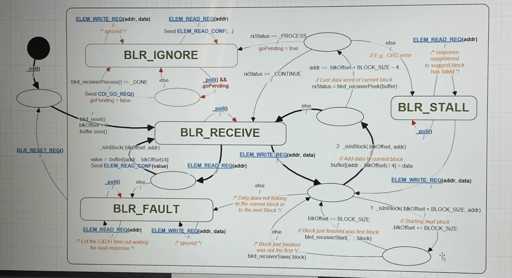

# HMK - Hard-state Machine Kit

A visual notation system for state machines with strong guarantees around atomicity, nesting, and deterministic behavior.

## Why "Hard-state"?

The distinguishing feature of this notation is the concept of **hard states**: the only locations where a machine can persistently reside. Everything else—decision points, transition paths, action sequences—is transient. A machine is always "at rest" in exactly one hard state until a trigger moves it atomically to another hard state.

This constraint enables:
- Clean implementation mapping (only hard states need persistent storage)
- Race-free execution (atomic transitions are uninterruptible)
- Verifiable completeness (all paths must terminate in hard states)

---

## Core Visual Elements

### Hard States

```
┌─────────────────┐
│   STATE_NAME    │  ← Rounded rectangle
└─────────────────┘
```

**Visual**: Rounded rectangles

**Semantics**: The only places where a machine can persistently reside

**Properties**:
- Must have unique names within their scope
- Can hold persistent variables (e.g., `goPending`, `blkOffset`, `buffer`)
- Can contain other hard states (nesting)
- Define which triggers can initiate transitions

**Key insight**: If you ask "where is the machine right now?" the answer is always a hard state name, never "in the middle of a transition" or "at a decision point."

### Decision Points

```
    ╭───────╮
    │       │  ← Oval/ellipse
    ╰───────╯
```

**Visual**: Ovals (ellipses)

**Semantics**: Transient evaluation points that exist only during atomic transitions

**Dual purpose**:
1. **Conditional branching**: Evaluate conditions and select paths
2. **Join points**: Multiple transition paths converge

**Critical property**: A machine *never rests* at a decision point. They are waypoints within an atomic transition, not destinations.

### Initial State Marker

```
    ●────→  ← Solid black dot with arrow
```

**Visual**: Solid black dot (●)

**Dual purpose**:
1. **Machine startup**: Indicates which hard state is active when the machine initializes
2. **Nested entry**: When transitioning to a container hard state, marks which inner state becomes active

---

## Triggers

Triggers are events that can initiate state transitions. The hard state in effect when a trigger arrives determines which transition path is evaluated.

### Message Triggers

**Notation**: Function-like syntax with parameters

```
ELEM_READ_REQ(addr)
ELEM_WRITE_REQ(addr, data)
BLR_RESET_REQ()
```

**Semantics**: Discrete external events from other machines or systems

**Properties**:
- Arrive from outside the machine
- Can carry parameters (addresses, data values, etc.)
- Receipt initiates transition evaluation
- No guaranteed delivery timing

### Poll Triggers

**Notation**: `_poll()` function call

**Semantics**: Regular autonomous checking events, like an idle task

**Properties**:
- Self-generated, not from external sources
- Allow checking conditions without external stimulus
- Enable autonomous behavior
- Machine can evaluate internal state or external conditions periodically

**Mental model**: Polls are the machine "waking up periodically to check if anything needs doing."

### Timer Triggers

**Notation**: Timer-specific message names (context-dependent)

**Semantics**: Time-based events requested by the machine itself

**Properties**:
- Machine arms timers with specified durations during transitions
- Timer expiration arrives as a trigger
- Timers can be canceled during subsequent transitions
- Multiple active timers permitted

**Hybrid nature**: Autonomous like polls (self-generated), but discrete like messages (specific events).

---

## Transition Notation

### Basic Format

```
condition / action
```

- **Before slash**: Conditional expression (if present)
- **After slash**: Pseudocode, actions, or commentary
- **No condition**: Unconditional transition (just `/` or nothing)

### Examples

```
rxStatus == _PROCESS / goPending = true
```
↑ If rxStatus equals _PROCESS, set goPending to true

```
else / // Last data word of current block
```
↑ Else branch with explanatory comment

```
_poll() /
```
↑ Poll trigger with no action (or action elsewhere)

```
/ blrd_reset()
  blkOffset = 0
  buffer.zero()
```
↑ Unconditional with multiple actions

### Evaluation Order

**Notation**: Numbered prefixes (1., 2., 3.) on transition arrows

```
    1: _isInBlock(blkOffset + BLOCK_SIZE, addr)
    2: _isInBlock(blkOffset, addr)
```

**Rule**: Evaluation order must always be unambiguous. Numbers indicate the sequence in which conditions are checked when multiple paths exist from a single trigger.

### Conditional Coverage

Every decision point must have complete condition coverage:
- Explicit conditions with matching `else` clauses
- Multiple explicit conditions covering all cases
- No "undefined behavior" paths allowed

---

## Atomicity Guarantee

**Core principle**: The path from trigger acceptance to landing in the next hard state is uninterruptible.

This means:
1. Complete evaluation of all decision points along the path
2. All actions execute to completion
3. Messages can be emitted during transition
4. No interruption until reaching the destination hard state

**Implication**: You can reason about the machine as if transitions happen instantaneously. Between any two observations, the machine moved from one hard state to another (possibly the same one) via a complete atomic transition.

---

## Data Handling

### Persistent Variables

**Location**: Associated with hard states

**Scope**: Maintained across state transitions

**Examples**: `goPending`, `blkOffset`, `buffer`

**Lifetime**: Exist as long as the machine exists

**Access**: Available to transition logic originating from the containing hard state

### Transient Data

**Location**: Evaluated during decision point processing

**Scope**: Only meaningful during atomic transition

**Examples**: `rxStatus` (return values), function call results

**Lifetime**: Exists only during transition evaluation

**Usage**: Used for branching decisions, not stored between transitions

---

## Nesting Semantics

### Hierarchical States

Hard states can contain other hard states, creating a hierarchy.

**Trigger inheritance**: Triggers defined on an outer boundary apply to all contained states. This provides hierarchical interrupt/event handling.

**Example**: A `RESET_REQ` trigger on the outer boundary of a container state can be received regardless of which inner state is currently active.

### Naming Conventions

- **Top-level states**: Explicitly named (e.g., `BLR_IGNORE`, `BLR_RECEIVE`)
- **Nested states**: Often unnamed in visual notation

**Implementation benefit**: Only leaf states require unique identifiers in code. Nesting provides natural scoping.

### Entry to Nested States

When a transition leads to a container hard state:
1. The black dot (●) inside marks the default entry state
2. Transition completes by landing in that inner hard state

---

## Message Communication

### Emission During Transitions

Messages can be sent as part of any transition's action sequence:

```
/ Send ELEM_READ_CONF(value)
```

**Timing**: Occurs as part of the atomic transition

**Delivery**: No guaranteed delivery timing to receiving machine

### Reception

Messages are received only through the trigger mechanism. Each machine processes messages independently based on its current hard state.

---

## Implementation Mapping

| Notation Element | Implementation |
|------------------|----------------|
| Hard states | Enumerated types or constants |
| Current state | Single persistent variable |
| Decision points | Conditional logic (if/else, switch) |
| Atomic transitions | Critical sections (disable interrupts or equivalent) |
| Persistent variables | State machine struct fields |
| Transient data | Local variables in transition handler |

### Resource Ownership

- State machines own their data/variables
- Resources negotiated via state and messaging
- No external semaphores/locks needed
- Clear ownership boundaries through state design

---

## Verification Properties

### Path Completeness
- All paths must terminate in hard states
- Each trigger from a hard state must have a complete path to a hard state
- No "dangling" transitions allowed

### Condition Coverage
- Decision points must cover all possible conditions
- Typically ensured through `else` clauses
- Prevents undefined behavior

### Nested Trigger Handling
- Triggers on outer boundaries must be handleable from any contained state
- Ensures consistent hierarchical response

---

## Worked Example: Block-Level Receiver (BLR)



This diagram demonstrates a block-level receiver with error handling and flow control.

### Hard States

| State | Purpose |
|-------|---------|
| `BLR_IGNORE` | Idle state, not actively receiving blocks |
| `BLR_RECEIVE` | Actively receiving block data |
| `BLR_FAULT` | Error state, letting upstream timeout |
| `BLR_STALL` | Waiting for downstream to clear |

### Persistent Variables

- `goPending`: Boolean flag for pending go signal
- `blkOffset`: Current offset into block buffer
- `buffer`: Data buffer for received block

### Key Transitions

**Initialization** (black dot → `BLR_IGNORE`):
- Machine starts in IGNORE state
- `_init()` trigger with reset actions

**IGNORE → RECEIVE** (on poll with goPending):
```
_poll() && goPending / blrd_reset()
                       blkOffset = 0
                       buffer.zero()
```

**RECEIVE processing** (on ELEM_WRITE_REQ):
The numbered transitions show evaluation order:
1. Check if address is in *next* block range → advance to next block
2. Check if address is in *current* block range → store data

**Error handling**:
- CRC error or out-of-range address → `BLR_FAULT`
- FAULT state suppresses read responses to signal failure upstream

**Flow control**:
- When downstream isn't ready (rxStatus != CONTINUE) → `BLR_STALL`
- STALL returns to RECEIVE when poll detects readiness

### Reading the Diagram

1. **Find the black dot** (●): Machine starts in `BLR_IGNORE`
2. **Identify triggers**: Underlined labels on arrows entering decision points
3. **Follow decision paths**: Conditions before `/`, actions after
4. **Check numbered priorities**: Lower numbers evaluate first
5. **Trace complete paths**: Every path from trigger must reach a hard state

---

## Design Principles

### Minimal Widget Set

Only three visual primitives:
1. Hard states (rounded rectangles)
2. Decision points (ovals)
3. Initial markers (black dots)

This simplicity reduces cognitive load and avoids over-specification.

### Layout Freedom

No formal layout rules. Spatial arrangement should:
- Emerge from natural design flow
- Optimize for clarity of the specific system
- Follow human intuition about information flow

### Implementation-Oriented

The notation maps cleanly to code:
- Hard states → enum values
- Transitions → switch/case handlers
- Atomic guarantee → critical sections
- Persistent variables → struct fields

---

## Quick Reference

### Shapes
- **Rounded rectangle**: Hard state (persistent, named)
- **Oval**: Decision/join point (transient)
- **Black dot**: Initial state marker

### Transition Labels
- `trigger / action` — basic format
- `condition / action` — conditional path
- `else / action` — else branch
- `1:`, `2:` — evaluation order

### Trigger Types
- `MESSAGE_NAME(params)` — external message
- `_poll()` — autonomous check
- Timer expiration — self-requested timeout

### Guarantees
- Machine always at rest in exactly one hard state
- Transitions are atomic and uninterruptible
- All paths must terminate in hard states
- Decision points must have complete condition coverage
